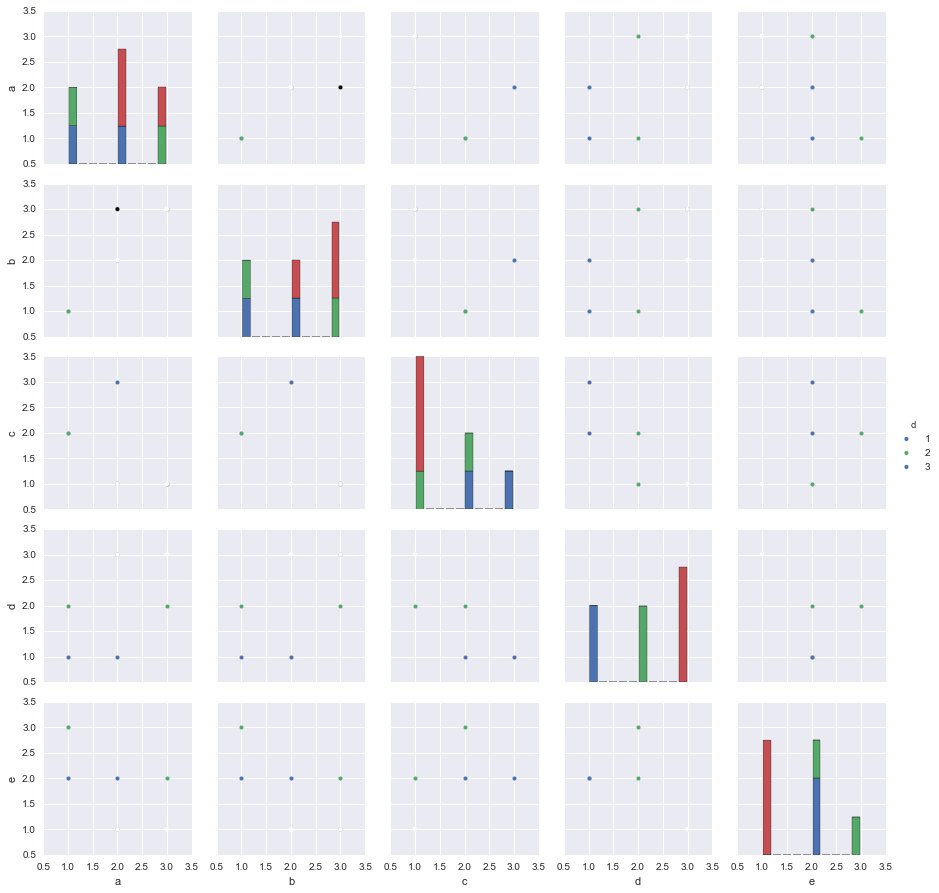

# DataFrame.to_string と ZipFile.writestr調べた
## 本題
DataFrameをzipに圧縮したかった

- 0.17.1でgz化はできるけど、zipはできない
- 一旦ファイルにしてからzipにするのめんどい
- ZipFile.writestr という文字列をarchiveに含めることが出来ることを知る
- DataFrameにto_string という文字列化メソッドがあることを知る

結果としては、to_stringとopen(to_csv).read()は一致しないので、諦めて別の方法で解決した

## 過程で関係ないけど調べたこと
- randintとrand_integersの違いを知った(閉区間と開区間)
- memory上でのzipファイル作成
- pansas.to_datetime はそれっぽい文字列をparseしてくれる
- seaborn便利

df_to_str_and_zip_write_str.py

```python3
import numpy as np
import pandas as pd
import matplotlib
import matplotlib.pyplot as plt
import seaborn as sns
%matplotlib inline
np.random.seed(0)

_1_to_3less = np.random.randint(1, 3, size=(7, 5))
_1_to_3less

    array([[1, 2, 2, 1, 2],
           [2, 2, 2, 2, 2],
           [2, 1, 1, 2, 1],
           [1, 1, 1, 1, 2],
           [1, 2, 2, 1, 1],
           [2, 2, 2, 2, 1],
           [2, 1, 2, 1, 2]])


_1_to_3 = np.random.random_integers(1, 3, size=(7, 5))
_1_to_3

    array([[2, 3, 1, 3, 1],
           [2, 2, 3, 1, 2],
           [2, 2, 1, 3, 1],
           [3, 3, 1, 3, 1],
           [1, 1, 2, 2, 3],
           [1, 1, 2, 1, 2],
           [3, 3, 1, 2, 2]])

df = pd.DataFrame(_1_to_3, columns=list("abcde"))
print(df.to_string(index=False, header=False), end="")

     2  3  1  3  1
     2  2  3  1  2
     2  2  1  3  1
     3  3  1  3  1
     1  1  2  2  3
     1  1  2  1  2
     3  3  1  2  2

import io
strio = io.StringIO()
_str = df.to_string(buf=strio)
print(_str)
print(strio.getvalue())
#for l in strio:
#    print(l)
# なぜかread系はFalseになる値が返ってくる, to_string()をStrinIO()に渡せば問題ない…

    None
       a  b  c  d  e
    0  2  3  1  3  1
    1  2  2  3  1  2
    2  2  2  1  3  1
    3  3  3  1  3  1
    4  1  1  2  2  3
    5  1  1  2  1  2
    6  3  3  1  2  2

import os
csv_file = "______.csv"
df.to_csv(csv_file, index=False, header=False)
with open(csv_file) as f:
    print(f.read())

    2,3,1,3,1
    2,2,3,1,2
    2,2,1,3,1
    3,3,1,3,1
    1,1,2,2,3
    1,1,2,1,2
    3,3,1,2,2

# 文字列としての値がfile読み込みと同じであった場合
import zipfile
with zipfile.ZipFile("file.zip", "w", zipfile.ZIP_DEFLATED) as z:
    z.writestr("file.txt", df.to_string())
    z.writestr("depth1/2.txt", "test")

# おまけ1
from contextlib import ExitStack
with ExitStack() as s:
    _bio = s.enter_context(io.BytesIO())
    z = s.enter_context(zipfile.ZipFile(_bio, "w", compression=zipfile.ZIP_DEFLATED))
    z.writestr("a.txt", "aaaa")
    z.writestr("c/d.txt", "ccdd")
    print(_bio.getvalue()[:4])

    b'PK\x03\x04'

# おまけ2
pd.to_datetime("now").date().isoformat()
pd.to_datetime("+1days") # 0.17.1ではエラー以前は文字列のまま返ってくる

# おまけ3
sns.pairplot(data=df, hue="d")

    <seaborn.axisgrid.PairGrid at 0x12094fc88>
```



