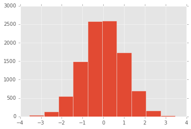
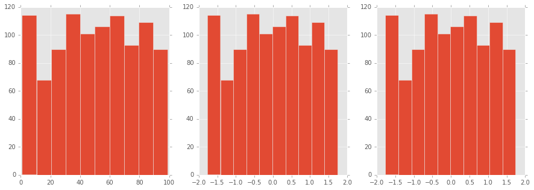

# ランダムデータと正規化・標準化
## データ準備用
```python3
import numpy as np
import pandas as pd
import matplotlib.pyplot as plt
import seaborn as sns

%matplotlib inline

# [0, 1)
np.random.rand(nrow, ncol)

# 1~100の範囲を重複アリで10個ランダム
np.random.randint(1, 100, 10)

# 正規分布
norm_data = np.random.randn(1, 10000)[0]
pd.Series(norm_data[0], name="a").hist()
```



## データ準備と準備してからの標準化
```python3
import string

np.random.seed(0)
data = {
    "a": range(1, 1000+1),
    "b": list(string.ascii_letters[:25] * 40),
    "c": [1,2,3,4] * 250,
    "d": np.random.rand(1000),
    "e": np.random.randn(1000),
    "f": np.random.randint(1, 100, 1000)
}
df = pd.DataFrame(data)

# カテゴリ変数化
df["c"].head(1)
# 0    1
# Name: c, dtype: int64

df["c"] = df.c.astype("category")
df["c"].head(1)
# 0    1
# Name: c, dtype: category
# Categories (4, int64): [1, 2, 3, 4]
```

```python3
from sklearn.preprocessing import scale
# normalize はベクトルの正規化だった
figure, axes = plt.subplots(1, 3, figsize=(15, 5))
df["f"].hist(ax=axes[0])
(df.f - df.f.mean()).div(df.f.std()).hist(ax=axes[1])
plt.hist(scale(df["f"].astype("float")))
```



### 余談

#### 平均を0にする
1. 各データの合計を要素数で割ると平均になる
2. つまり割る前は要素数×平均になっている
3. つまり各要素から平均を引けば、平均は0になる

#### 分散を1にする
$\mathrm{Var}[X] = E[(X-\mu)^2] = \dfrac{1}{n}\displaystyle\sum_{i=1}^n(x_i-\mu)^2$
$ \sigma = \sqrt[]{Var[X]} $

##### 平均が0のとき
- 標準化しても分子変わらないので、標準化後の平均は0のまま

- $Var[X/\sigma] = \dfrac{1}{n}\displaystyle\sum_{i=1}^n(x_i/\sigma - 0)^2 $
- 上記にて、$\sigma$はindex $i$に関係ないので$\sum$の外に出せる
- $\dfrac{1}{\sigma^2}\dfrac{1}{n}\displaystyle\sum_{i=1}^n(x_i - 0)^2 $
- 上記は$\dfrac{1}{\sigma^2}Var[X] $ より 1となる

##### 平均がμのとき
- 標準化後の平均は全ての要素が $1/\sigma$ より $\mu/\sigma$
- $Var[X/\sigma] = \dfrac{1}{n}\displaystyle\sum_{i=1}^n(x_i/\sigma - \mu/\sigma)^2 $
- $ (x_i/\sigma - \mu/\sigma)^2 = \dfrac{(x_i - \mu)^2}{\sigma^2} $
- より平均0のときと同様に展開して分散は1となる


#### もう１つの正規化を考える
$(x_i - x_{min})/(x_{max} - x_{min})$

1. 最小値を各要素から引く
2. 引く前の最小値はもちろん最小値なので、その後の最小値は0になる
3. 最大値は最大値と最小値の差分となる
3. 最大値と最小値の差分をとり、各要素から最小値を引いた値を割る
4. 最大値は項2より差分で割ると1になる
5. 最小値は0なので変わらず0である
6. これより0〜1の範囲になった


## quantile
[階級作成とDummy変数の作成](http://qiita.com/ksomemo/items/f658742a18ad804caa5f)でやったqcutとほぼ同じだけど集約される。

```python3
# 10分位
decile = list(map(lambda x: x / 10, range(0, 10+1)))
decile

	a	d	e	f
0.0	1.0	0.000546	-2.994613	1
0.1	100.9	0.100287	-1.198404	9
0.2	200.8	0.203938	-0.825520	22
0.3	300.7	0.292981	-0.481149	33
0.4	400.6	0.383455	-0.199363	41
0.5	500.5	0.481323	0.030935	51
0.6	600.4	0.588486	0.245125	60
0.7	700.3	0.696379	0.501393	69
0.8	800.2	0.806419	0.835011	79
0.9	900.1	0.907747	1.324424	89
1.0	1000.0	0.999809	3.170975	99
```

